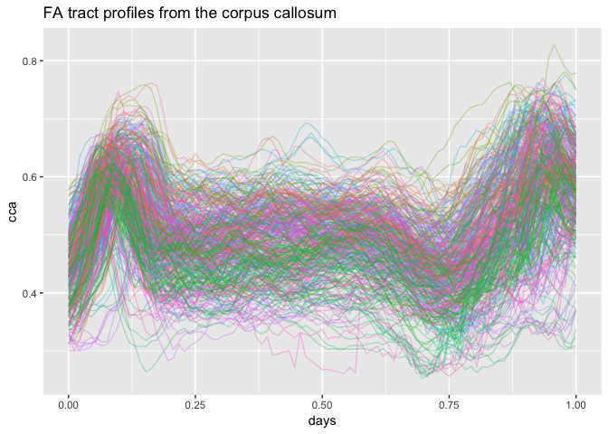

## FDA Functions for tf-Class

## Introduction

**`tidyfun`** is geared toward making functional data analysis (FDA)
easy, especially for data wrangling and exploratory analysis.

Look [here](https://fabian-s.github.io/tidyfun/) for an introduction on
**`tidyfun`** with examples.

Further examples on data wrangling and plotting with tdf class on this
github page can be found in the data preparation folder
[here](https://github.com/gekim0519/tidyfun_fpca/blob/master/data_preparation/preparation.md).

## Objective

  - The role of this project is to extend functions for FDA. Specially,
    four functions were made for conducting fpca and function-on-scalar
    regression on tfd data types.
  - The functions are modified from the **`refund`** package
    ([link](https://github.com/refunders/refundable)) to take in a
    dataframe containing tfd columns directly as an input.

## Data Description

The type of data we will be working with is **`tf`-Class** data and more
specifically, **`tfd`** objects. **`tfd`** is one of the two subclasses
of **`tf`-Class**, a new data type that allows functional data to be
stored as vectors. More information on **`tf`-Class** can be found
[here](https://fabian-s.github.io/tidyfun/articles/x01_Intro.html).

**Example Dataset - DTI, Diffusion Tensor Imaging**

  - Fractional anisotropy (FA) tract profiles for the corpus callosum
    (cca) and the right corticospinal tract (rcst).
  - The MRI/DTI data were collected at Johns Hopkins University and the
    Kennedy-Krieger Institute.
  - `DTI` has 382 rows and 9 columns including two functional covariates
    (`cca`, `rcst`) in forms of matrices.
  - Using tidyfun, new dataframe `dti` has cca and rcst in tfd type.
  - Link to further description:
    [rdrr.io/cran/refund/man/DTI.html](rdrr.io/cran/refund/man/DTI.html)

<!-- end list -->

``` r
DTI = refund::DTI

dti = with(refund::DTI, 
  data.frame(id = ID, sex = sex, 
    case = factor(ifelse(case, "MS", "control")))) %>% as.tbl %>% 
        mutate(cca = tfd(DTI$cca, seq(0,1, l = 93), signif = 2) %>%
                     tfd(arg = seq(0,1,l = 93)),
               rcst = tfd(DTI$rcst, seq(0, 1, l = 55), signif = 3))

dti %>%
  head()
```

    ## # A tibble: 6 x 5
    ##      id sex    case   cca                        rcst                      
    ##   <dbl> <fct>  <fct>  <S3: tfd_reg>              <S3: tfd_irreg>           
    ## 1  1001 female contr… 1001_1: (0.000,0.49);(0.0… 1001_1: (0.000,0.26);(0.0…
    ## 2  1002 female contr… 1002_1: (0.000,0.47);(0.0… 1002_1: ( 0.22,0.44);( 0.…
    ## 3  1003 male   contr… 1003_1: (0.000,0.50);(0.0… 1003_1: ( 0.22,0.42);( 0.…
    ## 4  1004 male   contr… 1004_1: (0.000,0.40);(0.0… 1004_1: (0.000,0.51);(0.0…
    ## 5  1005 male   contr… 1005_1: (0.000,0.40);(0.0… 1005_1: ( 0.22,0.40);( 0.…
    ## 6  1006 male   contr… 1006_1: (0.000,0.45);(0.0… 1006_1: (0.056,0.47);(0.0…

Let’s view cca in a spaghetti plot.

``` r
dti %>%  
  ggplot(aes(y = cca, color = factor(id))) + 
  geom_spaghetti(alpha = .3) + xlab("days") + theme(legend.position="none") + ggtitle("FA tract profiles from the corpus callosum")
```

<!-- -->

## Functions and Usage

#### Functional principal components analysis (FPCA) by smoothed covariance

**Model**

  
 = \\mu(t) + \\sum C_{ik} \\phi_{k}(t) + \\epsilon_i(t) 
")  

**`fpca.tdf`**

  - Decomposes functional observations using functional principal
    components analysis. A mixed model framework is used to estimate
    scores and obtain variance estimates.
  - Altered from `refund::fpca.sc`, fpca.tfd allows users to apply the
    function directly on dataframes with a tfd column, specified in the
    `col` argument.
  - Uses penalized splines to smooth the covariance function, as
    developed by Di et al. (2009) and Goldsmith et al. (2013).

#### Example

``` r
# DTI
fit.cca = fpca.tfd(data = dti, col = cca)

fit.mu = data.frame(mu = fit.cca$mu,
                    n = 1:ncol(fit.cca$Yhat))
fit.basis = data.frame(phi = fit.cca$efunctions, #the FPC basis functions.
                       n = 1:ncol(fit.cca$Yhat))
```

Let’s plot the estimated mean function of `cca`.

``` r
## plot estimated mean function
ggplot(fit.mu, aes(x = n, y = mu)) + geom_path() + theme_bw() + ggtitle("Estimated mean function of corpus callosum")
```

<!-- -->

There are nine basis eigenfunctions in `fit.basis`. Let’s plot the first
two.

``` r
## plot the first two estimated basis functions
fit.basis.m = melt(fit.basis, id = 'n')
ggplot(subset(fit.basis.m, variable %in% c('phi.1', 'phi.2')), aes(x = n,
y = value, group = variable, color = variable)) + geom_path() + theme_bw() + ggtitle("First two estimated FPC basis functions")
```

<!-- -->

#### Function-on-Scalar Regression (FoSR)

**Model**

  
 = \\beta_{0}(t) + \\sum x_{ik} \\beta_{k}(t) + \\epsilon_i(t)
")  

**ols\_cs\_tfd**

  - Fitting function for FoSR for cross-sectional data, estimates model
    parameters using GLS.
  - We edited `refund::ols_cs`. While the inputs did not change,
    `ols_cs_tfd`’s argument, data will be a dataframe with `tfd` type
    column, which will be the response of the proposed model.

\`
