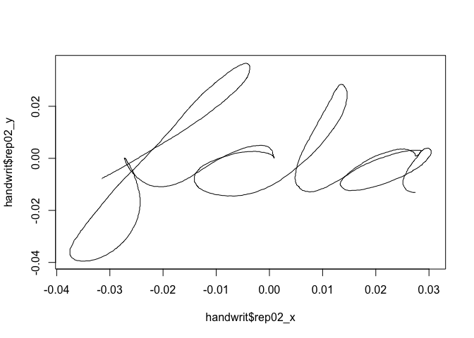
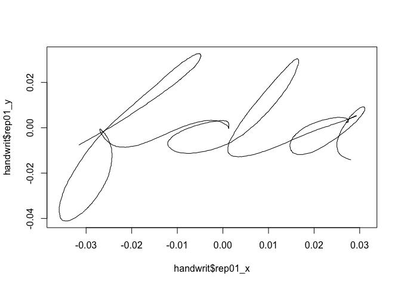

tdf Exploration
================
Gaeun Kim

CanadianWeather
---------------

Data decription can be found [here](https://www.rdocumentation.org/packages/fda/versions/2.4.8/topics/CanadianWeather).

Loading and cleaning step

``` r
load("../data/CanadianWeather.rda")

cwtemp = CanadianWeather[[1]] %>% as.tibble() %>%
  t() %>% as.matrix() %>%
  .[1:35,]

place = c(CanadianWeather$place)
temp_df = data.frame(place = CanadianWeather$place)
temp_df$temp = cwtemp

temp_tfd = with(temp_df, 
  data.frame(place = place)) %>% as.tbl %>% 
  mutate(temp = tfd(temp_df$temp))
```

    ## Column names not suitable as arg. Using 1:ncol(data).

``` r
# tfd(temp_df$temp)) (1, -4) to jan1, -4? 
```

Made the temp data to a `tdf` format!

Let's graph them.

``` r
temp_tfd %>% 
  filter(place == "Halifax") %>% 
  ggplot(aes(y = temp)) + 
  geom_spaghetti() +
  ggtitle(label = "Average daily temperature for each day of the year in Halifax")
```


``` r
temp_tfd %>%  
  filter(place %in% c("Quebec", "Vancouver")) %>% 
  ggplot(aes(y = temp, color = place)) + 
  geom_spaghetti(alpha = .3) + 
  geom_meatballs(aes(alpha = .5)) +
  facet_grid(~ place)
```



Example with `DTI` at `tidyfun` page
------------------------------------

``` r
# tidyfun example
DTI = refund::DTI

dti = with(refund::DTI, 
  data.frame(id = ID, sex = sex, 
    case = factor(ifelse(case, "MS", "control")))) %>% as.tbl %>% 
        mutate(cca = tfd(DTI$cca, seq(0,1, l = 93), signif = 2) %>%
                     tfd(arg = seq(0,1,l = 93)),
               rcst = tfd(DTI$rcst, seq(0, 1, l = 55), signif = 3))

dti %>%
  filter(id == 2031)
```

    ## # A tibble: 2 x 5
    ##      id sex    case  cca                         rcst                      
    ##   <dbl> <fct>  <fct> <S3: tfd_reg>               <S3: tfd_irreg>           
    ## 1  2031 female MS    [1]: (0.000,0.51);(0.011,0… [1]: (0.000,0.51);(0.019,…
    ## 2  2031 female MS    [2]: (0.000,0.55);(0.011,0… [2]: (0.000,0.50);(0.019,…

Are the two datasets `DTI` and `dti` the same?

`dti` seems to be same as `DTI` except the null values inside `DTI` have been imputed in the `tfd`. Let's look insdie `dti`'s `cca`.

``` r
dti_testing = dti
dti_testing["cca"] = dti$cca %>% 
  as.data.frame() %>%
  spread(key = arg, value = value) %>%
  select(-id) %>%
  as.matrix() 

dti_cca = dti_testing$cca %>% as.data.frame()
DTI_cca = DTI$cca %>% as.data.frame()
rownames(dti_cca) = rownames(DTI_cca)
colnames(dti_cca) = colnames(DTI_cca)

dti_cca %>% is.na() %>% sum() #0 
```

    ## [1] 0

``` r
DTI_cca %>% is.na() %>% sum() #36
```

    ## [1] 36

So I see that while both `cca` columns have the same values for non-missing data, `cca` at `dti` have no missing values while `DTI` has 36 missings.

Handwriting Data
----------------

``` r
# cursive handwriting coordinates
#load data
load("../data/handwrit.rda")

handwrit_time <- handwritTime %>% as.tibble() %>%
  janitor::clean_names()
rm(handwritTime)

handwrit <- handwrit %>%
  as.tibble() %>%
  janitor::clean_names()
```

``` r
plot(handwrit$rep01_x, handwrit$rep01_y, type="l")
```



Making handwriting data to `tfd` format!

``` r
hw_x = handwrit %>% 
  as.matrix() %>%
  .[,1:20] %>%
  t()
hw_y = handwrit %>% 
  as.matrix() %>%
  .[,21:40] %>%
  t()
  
handw_tfd = data.frame(id = 1:20) %>%
  as.tbl %>% 
  mutate(x = tfd(hw_x),
         y = tfd(hw_y))

handw_tfd %>% 
  filter(id == 1) %>% 
  ggplot(aes(y = y)) + 
  geom_spaghetti()
```


We can't combine x and y coordinates in `tdf` format :( (x and y are not all unique values).

Saving the datasets

``` r
#save(temp_tfd, file = "../data/temp_tdf.RData")
#save(handw_tfd, file = "../data/handw_tdf.RData")
```
