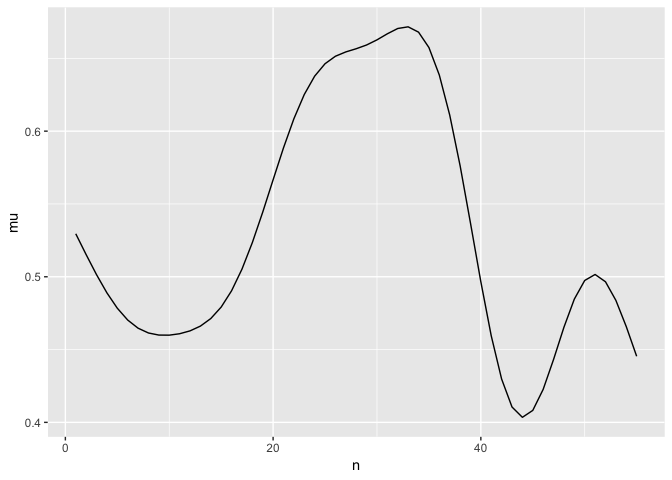
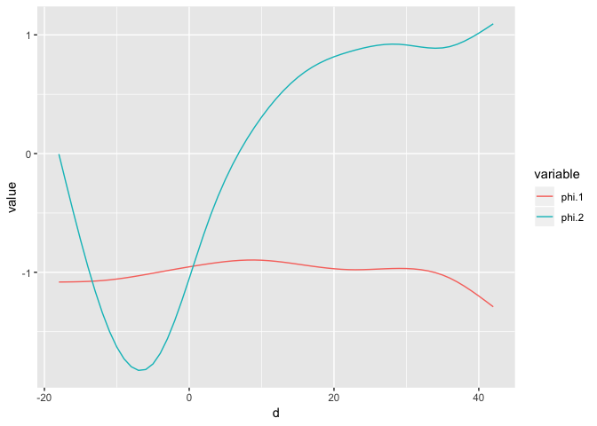
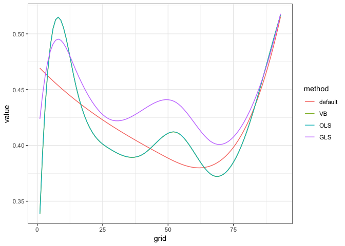
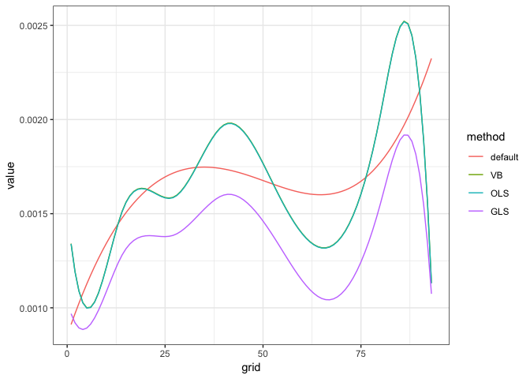

explore tidyfun
================
Gaeun Kim
1/4/2019

read in datasets

``` r
temp_tfd = load("data/temp_tfd.RData")
handw_tfd= load("data/handw_tfd.RData")

DTI = refund::DTI

dti = with(refund::DTI, 
  data.frame(id = ID, sex = sex, 
    case = factor(ifelse(case, "MS", "control")))) %>% as.tbl %>% 
        mutate(cca = tfd(DTI$cca, seq(0,1, l = 93), signif = 2) %>%
                     tfd(arg = seq(0,1,l = 93)),
               rcst = tfd(DTI$rcst, seq(0, 1, l = 55), signif = 3))
```

fpca.tfd function examples

``` r
fit.cca = fpca.tfd(data = dti, col = rcst)

fit.mu = data.frame(mu = fit.cca$mu,
                    n = 1:ncol(fit.cca$Yhat))
fit.basis = data.frame(phi = fit.cca$efunctions, #the FPC basis functions.
                       n = 1:ncol(fit.cca$Yhat))

## plot estimated mean function
ggplot(fit.mu, aes(x = n, y = mu)) + geom_path() 
```



``` r
## plot the first two estimated basis functions
fit.basis.m = melt(fit.basis, id = 'n')
ggplot(subset(fit.basis.m, variable %in% c('phi.1', 'phi.2')), aes(x = n,
y = value, group = variable, color = variable)) + geom_path()
```


putting cd4 dataset to fpca.tfd function

``` r
data(cd4)
# CD4 cell counts for 366 subjects between months -18 and 42 since seroconversion. Each subject's observations are contained in a single row.
# subject * weeks

cd4_tfd = cd4 %>%
  tfd()
cd4_df = data_frame(cd4_tfd, id = 1:366) %>%
  select(cd4 = cd4_tfd, everything())

fit.cd4 = cd4_df %>%
  fpca.tfd(data =., col = cd4)

fit.mu = data.frame(mu = fit.cd4$mu,
                    n = 1:ncol(fit.cd4$Yhat))
fit.basis = data.frame(phi = fit.cd4$efunctions, #the FPC basis functions.
                       n = 1:ncol(fit.cd4$Yhat))

## plot estimated mean function
ggplot(fit.mu, aes(x = n, y = mu)) + geom_path() 
```


cd4 example on the refund page

``` r
Fit.MM = fpca.sc(cd4, var = TRUE, simul = TRUE)

Fit.mu = data.frame(mu = Fit.MM$mu,
                    d = as.numeric(colnames(cd4)))
Fit.basis = data.frame(phi = Fit.MM$efunctions, # d × npc matrix of estimated eigenfunctions of the functional covariance, i.e., the FPC basis functions.
                       d = as.numeric(colnames(cd4)))

## for one subject, examine curve estimate, pointwise and simultaneous itervals
EX = 1
EX.MM = data.frame(fitted = Fit.MM$Yhat[EX,],
           ptwise.UB = Fit.MM$Yhat[EX,] + 1.96 * sqrt(Fit.MM$diag.var[EX,]),
           ptwise.LB = Fit.MM$Yhat[EX,] - 1.96 * sqrt(Fit.MM$diag.var[EX,]),
           simul.UB = Fit.MM$Yhat[EX,] + Fit.MM$crit.val[EX] * sqrt(Fit.MM$diag.var[EX,]),
           simul.LB = Fit.MM$Yhat[EX,] - Fit.MM$crit.val[EX] * sqrt(Fit.MM$diag.var[EX,]),
           d = as.numeric(colnames(cd4)))

## plot data for one subject, with curve and interval estimates
EX.MM.m = melt(EX.MM, id = 'd')
ggplot(EX.MM.m, aes(x = d, y = value, group = variable, color = variable, linetype = variable)) +
  geom_path() +
  scale_linetype_manual(values = c(fitted = 1, ptwise.UB = 2,
                        ptwise.LB = 2, simul.UB = 3, simul.LB = 3)) +
  scale_color_manual(values = c(fitted = 1, ptwise.UB = 2,
                     ptwise.LB = 2, simul.UB = 3, simul.LB = 3)) +
  labs(x = 'Months since seroconversion', y = 'Total CD4 Cell Count')
```


``` r
## plot estimated mean function
ggplot(Fit.mu, aes(x = d, y = mu)) + geom_path() +
  labs(x = 'Months since seroconversion', y = 'Total CD4 Cell Count')
```


``` r
## plot the first two estimated basis functions
Fit.basis.m = melt(Fit.basis, id = 'd')
ggplot(subset(Fit.basis.m, variable %in% c('phi.1', 'phi.2')), aes(x = d,
y = value, group = variable, color = variable)) + geom_path()
```

 looks same as the tfd version!

bayes\_fosr: "Wrapper function that implements several approaches to Bayesian function on scalar regression."

Exammple code from refund

-   I am getting errors regarding gibbs so I removed it from the sample for now.
-   error message: Error in tx\[, ind.cur\] %\*% siginv : non-conformable arguments

I won't alter DTI like they did in refund because I want it to be same as dti, a tdf format of DTI.

``` r
##### Cross-sectional real-data examples #####

## organize data
data(DTI)
#DTI = subset(DTI, select = c(cca, case, pasat))
#DTI = DTI[complete.cases(DTI),]
#DTI$gender = factor(sample(c("male","female"), dim(DTI)[1], replace = TRUE))
#DTI$status = factor(sample(c("RRMS", "SPMS", "PPMS"), dim(DTI)[1], replace = TRUE))

## fit models
default = bayes_fosr(cca ~ pasat, data = DTI)
```

    ## Beginning Algorithm 
    ## .........

``` r
VB = bayes_fosr(cca ~ pasat, data = DTI, Kp = 4, Kt = 10)
```

    ## Beginning Algorithm 
    ## .........

``` r
#Gibbs = bayes_fosr(cca ~ pasat, data = DTI, Kt = 10, est.method = "Gibbs", cov.method = #"Wishart", N.iter = 500, N.burn = 200)
OLS = bayes_fosr(cca ~ pasat, data = DTI, Kt = 10, est.method = "OLS")
```

    ## Using OLS to estimate model parameters

``` r
GLS = bayes_fosr(cca ~ pasat, data = DTI, Kt = 10, est.method = "GLS")
```

    ## Using OLS to estimate residual covariance 
    ## GLS

``` r
## plot results
models = c("default", "VB", "OLS", "GLS")
intercepts = sapply(models, function(u) get(u)$beta.hat[1,])
slopes = sapply(models, function(u) get(u)$beta.hat[2,])

plot.dat = melt(intercepts); colnames(plot.dat) = c("grid", "method", "value")
ggplot(plot.dat, aes(x = grid, y = value, group = method, color = method)) + 
   geom_path() + theme_bw()
```



``` r
plot.dat = melt(slopes); colnames(plot.dat) = c("grid", "method", "value")
ggplot(plot.dat, aes(x = grid, y = value, group = method, color = method)) + 
   geom_path() + theme_bw()
```



``` r
#Gibbs - Error in tx[, ind.cur] %*% siginv : non-conformable arguments
# removed Gibbs
```

ols\_cs: "Fitting function for function-on-scalar regression for cross-sectional data."

``` r
dti.ols = ols_cs(cca ~ pasat, data = DTI, Kt = 10)
```

    ## Using OLS to estimate model parameters

``` r
library(splines)
library(pbs)
```

Below is a ols function for cross-sectional tfd datasets.

``` r
ols_cs_tfd = function(formula, col = NULL, data=NULL, Kt=5, basis = "bs", verbose = TRUE){
  
  col = enquo(col) 
  
  tfd = data %>%
    pull(!! col)
  
  stopifnot((!is.null(tfd))) #needed right?
  
  tfd = tfd %>% 
  as.data.frame() %>%
  spread(key = arg, value = value) %>%
  select(-id) %>%
  as.matrix()
  
  data[as.character(col)[2]]= tfd
  
  call <- match.call()
  tf <- terms.formula(formula, specials = "re")
  trmstrings <- attr(tf, "term.labels")
  specials <- attr(tf, "specials")
  where.re <-specials$re - 1
  if (length(where.re) != 0) {
    mf_fixed <- model.frame(tf[-where.re], data = data)
    formula = tf[-where.re]
    responsename <- attr(tf, "variables")[2][[1]]
    ###
    REs = list(NA, NA)
    REs[[1]] = names(eval(parse(text=attr(tf[where.re], "term.labels")), envir=data)$data)
    REs[[2]]=paste0("(1|",REs[[1]],")")
    ###
    formula2 <- paste(responsename, "~", REs[[1]], sep = "")
    newfrml <- paste(responsename, "~", REs[[2]], sep = "")
    newtrmstrings <- attr(tf[-where.re], "term.labels")
    formula2 <- formula(paste(c(formula2, newtrmstrings), 
                              collapse = "+"))
    newfrml <- formula(paste(c(newfrml, newtrmstrings), collapse = "+"))
    mf <- model.frame(formula2, data = data)
    if (length(data) == 0) {
      Z = lme4::mkReTrms(lme4::findbars(newfrml), fr = mf)$Zt
    }
    else {
      Z = lme4::mkReTrms(lme4::findbars(newfrml), fr = data)$Zt
    }
  }
  else {
    mf_fixed <- model.frame(tf, data = data)
  }
  mt_fixed <- attr(mf_fixed, "terms")
  
  # get response (Y)
  Y <- model.response(mf_fixed, "numeric")
  
  # x is a matrix of fixed effects
  # automatically adds in intercept
  X <- model.matrix(mt_fixed, mf_fixed, contrasts)
  
  ### model organization ###
  D = dim(Y)[2]
  I = dim(X)[1]
  p = dim(X)[2]
  
  if(basis == "bs"){
    Theta = bs(1:D, df = Kt, intercept=TRUE, degree=3)
  } else if(basis == "pbs"){
    Theta = pbs(1:D, df = Kt, intercept=TRUE, degree=3)
  }

  X.des = X
  Y.vec = as.vector(t(Y)) 
  X = kronecker(X.des, Theta)
  n.coef = dim(X.des)[2]
  
  ## OLS model fitting and processing results
  if(verbose) { cat("Using OLS to estimate model parameters \n") }
  model.ols = lm(Y.vec ~ -1 + X)
  Bx.ols = matrix(model.ols$coef, nrow = Kt, ncol = n.coef)  
  beta.hat.ols = t(Bx.ols) %*% t(Theta)
    
  resid.mat = matrix(resid(model.ols), I, D, byrow = TRUE)
    
  ## Get Residual Structure using FPCA
  ## note: this is commented out because, in simulations based on the headstart data, 
  ## using FPCA lead to higher-than-nominal sizes for tests of nested models. 
  ## using the raw covariance worked better. using FPCA is possible, but relies
  ## on some case-specific choices.
  # raw.resid.cov = cov(resid.mat)
  # fpca.resid = fpca.sc(resid.mat, pve = .9995, nbasis = 20)
  # resid.cov = with(fpca.resid, efunctions %*% diag(evalues) %*% t(efunctions))
    
  ## account for (possibly non-constant) ME nugget effect
  # sm.diag = Theta %*% solve(crossprod(Theta)) %*% t(Theta) %*% (diag(raw.resid.cov) - diag(resid.cov))
  # if(sum( sm.diag < 0 ) >0) { sm.diag[ sm.diag < 0] = min((diag(raw.resid.cov) - diag(resid.cov))[ sm.diag < 0])}
  # diag(resid.cov) = diag(resid.cov) + sm.diag
    
  sigma = cov(resid.mat) * (I - 1) / (I - p)
  
  ## get confidence intervals
  beta.UB = beta.LB = matrix(NA, p, D)
  for(p.cur in 1:p){
    ## confidence intervals for this model shouldn't be trusted
  }
  
  Yhat = X.des %*% beta.hat.ols
  
  ret = list(beta.hat.ols, beta.UB, beta.LB, Yhat, mt_fixed, data, model.ols, sigma)
  names(ret) = c("beta.hat", "beta.UB", "beta.LB", "Yhat", "terms", "data", "model.ols", "sigma")
  class(ret) = "fosr"
  ret
    
}
```

I will use the function `ols_cs_tfd` on dti but before, I will alter the dataset like DTI is altered above.

``` r
dti["pasat"] = DTI$pasat

dti.ols.prac = ols_cs_tfd(cca ~ pasat, col = cca, data = dti, Kt = 10)
```

    ## Using OLS to estimate model parameters

``` r
## plot results
models = c("dti.ols", "dti.ols.prac")
intercepts = sapply(models, function(u) get(u)$beta.hat[1,])
slopes = sapply(models, function(u) get(u)$beta.hat[2,])

plot.dat = melt(intercepts); colnames(plot.dat) = c("grid", "method", "value")
ggplot(plot.dat, aes(x = grid, y = value, group = method, color = method)) + 
   geom_path() + theme_bw()
```


``` r
plot.dat = melt(slopes); colnames(plot.dat) = c("grid", "method", "value")
ggplot(plot.dat, aes(x = grid, y = value, group = method, color = method)) + 
   geom_path() + theme_bw()
```


checking if the datasets(altered dti and original DTI) are the same:

``` r
all(dti %>%
      pull(cca) %>%
      as.data.frame() %>%
      spread(key = arg, value = value) %>%
      select(-id) %>%
      as.matrix() == DTI$cca, na.rm = TRUE)
```

    ## [1] TRUE

``` r
all(dti$pasat == DTI$pasat, na.rm = TRUE)
```

    ## [1] TRUE

**issue**

the dataset altered inside ols\_cs\_tfd seems to be same as DTI but it's giving slightly different results as we can see in the graph above.

gibbs\_cs\_fpca: "Cross-sectional FoSR using a Gibbs sampler and FPCA"

``` r
#gibbs_cs_fpca(cca ~ pasat, data = DTI, Kt = 10)
#gibbs_cs_fpca_prac(cca ~ pasat, data = DTI, Kt = 10)

#keeps on running...
```

``` r
library(MASS)
```

    ## 
    ## Attaching package: 'MASS'

    ## The following object is masked from 'package:dplyr':
    ## 
    ##     select

``` r
library(lme4)
```

    ## Loading required package: Matrix

    ## 
    ## Attaching package: 'Matrix'

    ## The following object is masked from 'package:tidyr':
    ## 
    ##     expand

    ## 
    ## Attaching package: 'lme4'

    ## The following object is masked from 'package:nlme':
    ## 
    ##     lmList

``` r
# gibbs_cs_fpca_prac = 
```
