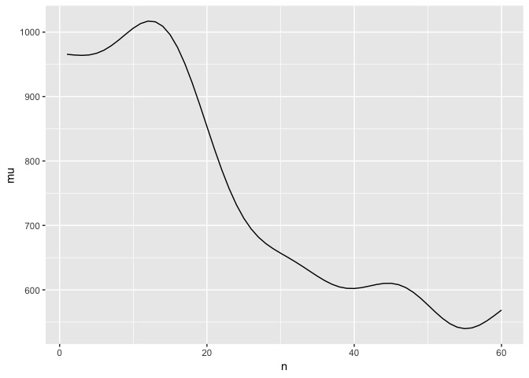
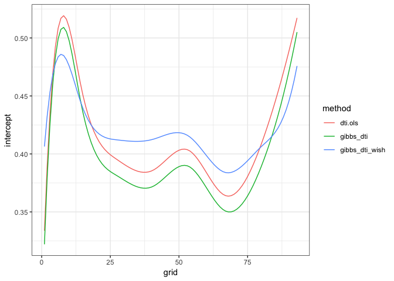

Functions Usage
================

First, let’s read in our tf datasets.

DTI

``` r
temp_tfd = load("../data/temp_tfd.RData")
handw_tfd= load("../data/handw_tfd.RData")

DTI = refund::DTI

dti = with(refund::DTI, 
  data.frame(id = ID, sex = sex, pasat = pasat, 
    case = factor(ifelse(case, "MS", "control")))) %>% as.tbl %>% 
        mutate(cca = tfd(DTI$cca, seq(0,1, l = 93), signif = 2) %>%
                     tfd(arg = seq(0,1,l = 93)),
               rcst = tfd(DTI$rcst, seq(0, 1, l = 55), signif = 3))
```

cd4

``` r
data(cd4)
cd4_tfd = cd4 %>%
  tfd()
cd4_df = data_frame(cd4_tfd)
```

    ## Warning: `data_frame()` is deprecated, use `tibble()`.
    ## This warning is displayed once per session.

## 1.fpca.tfd function example

``` r
source("../function/quadWeights.R")
source("../function/fpca.tfd.R")
```

``` r
# DTI
fit.cca = fpca.tfd(data = dti, col = cca)

fit.mu = data.frame(mu = fit.cca$mu,
                    n = 1:ncol(fit.cca$Yhat))
fit.basis = data.frame(phi = fit.cca$efunctions, #the FPC basis functions.
                       n = 1:ncol(fit.cca$Yhat))

## plot estimated mean function
ggplot(fit.mu, aes(x = n, y = mu)) + geom_path() + theme_bw()
```

<!-- -->

``` r
## plot the first two estimated basis functions
fit.basis.m = melt(fit.basis, id = 'n')
ggplot(subset(fit.basis.m, variable %in% c('phi.1', 'phi.2')), aes(x = n,
y = value, group = variable, color = variable)) + geom_path() + theme_bw()
```

<!-- -->

Putting cd4 dataset to fpca.tfd
function

``` r
fit.cd4 = fpca.tfd(data = cd4_df, col = cd4_tfd, var = TRUE, simul = TRUE)

fit.mu = data.frame(mu = fit.cd4$mu,
                    n = 1:ncol(fit.cd4$Yhat))
fit.basis = data.frame(phi = fit.cd4$efunctions, #the FPC basis functions.
                       n = 1:ncol(fit.cd4$Yhat))

## for one subject, examine curve estimate, pointwise and simultaneous itervals
ex = 1
ex.cd4 = data.frame(fitted = fit.cd4$Yhat[ex,],
           ptwise.UB = fit.cd4$Yhat[ex,] + 1.96 * sqrt(fit.cd4$diag.var[ex,]),
           ptwise.LB = fit.cd4$Yhat[ex,] - 1.96 * sqrt(fit.cd4$diag.var[ex,]),
           simul.UB = fit.cd4$Yhat[ex,] + fit.cd4$crit.val[ex] * sqrt(fit.cd4$diag.var[ex,]),
           simul.LB = fit.cd4$Yhat[ex,] - fit.cd4$crit.val[ex] * sqrt(fit.cd4$diag.var[ex,]),
           n = 1:ncol(fit.cd4$Yhat))

## plot data for one subject, with curve and interval estimates
ex.cd4.m = melt(ex.cd4, id = 'n')

## plot data for one subject, with curve and interval estimates
ex.cd4.m = melt(ex.cd4, id = 'n')
ggplot(ex.cd4.m, aes(x = n, y = value, group = variable, color = variable, linetype = variable)) +
  geom_path() +
  scale_linetype_manual(values = c(fitted = 1, ptwise.UB = 2,
                        ptwise.LB = 2, simul.UB = 3, simul.LB = 3)) +
  scale_color_manual(values = c(fitted = 1, ptwise.UB = 2,
                     ptwise.LB = 2, simul.UB = 3, simul.LB = 3)) +
  labs(x = 'Months since seroconversion', y = 'Total CD4 Cell Count')
```

<!-- -->

``` r
## plot estimated mean function
ggplot(fit.mu, aes(x = n, y = mu)) + geom_path() 
```

<!-- -->

``` r
## plot the first two estimated basis functions
fit.basis.m = melt(fit.basis, id = 'n')
ggplot(subset(fit.basis.m, variable %in% c('phi.1', 'phi.2')), aes(x = n,
y = value, group = variable, color = variable)) + geom_path()
```

<!-- -->

## 2\. ols\_cs\_tfd function example

Below is a ols function for cross-sectional tfd datasets.

``` r
source("../function/ols_cs_tfd.R")
```

I will put in our tf dataset that we made in the beginning,
    dti.

``` r
dti.ols = ols_cs_tfd(cca ~ pasat, data = dti, Kt = 10)
```

    ## Warning: Using `as.character()` on a quosure is soft-deprecated as of rlang 0.3.0.
    ## Please use `quo_text()` intead.
    ## This warning is displayed once per session.

    ## Using OLS to estimate model parameters

``` r
models = c("dti.ols")
intercepts = sapply(models, function(u) get(u)$beta.hat[1,])
slopes = sapply(models, function(u) get(u)$beta.hat[2,])

plot.dat = melt(intercepts); colnames(plot.dat) = c("grid", "method", "value")
ggplot(plot.dat, aes(x = grid, y = value, group = method, color = method)) + 
   geom_path() + theme_bw() 
```

<!-- -->

``` r
plot.dat = melt(slopes); colnames(plot.dat) = c("grid", "method", "value")
ggplot(plot.dat, aes(x = grid, y = value, group = method, color = method)) + 
   geom_path() + theme_bw() 
```

<!-- -->

gibbs\_cs\_fpca:

``` r
source("../function/gibbs_cs_fpca_tfd.R")
```

``` r
gibbs_dti = gibbs_cs_fpca_tfd(cca ~ pasat, data = dti, Kt = 10, N.iter = 500, N.burn = 200)
```

    ## Beginning Sampler 
    ## ..........

``` r
source("../function/gibbs_cs_wish_tfd.R")
```

``` r
gibbs_dti_wish = gibbs_dti_wish = gibbs_cs_wish_tfd(cca ~ pasat, data = dti, Kt = 10, N.iter = 500, N.burn = 200)
```

    ## Beginning Sampler 
    ## ..........

``` r
models = c("dti.ols", "gibbs_dti", "gibbs_dti_wish")
intercepts = sapply(models, function(u) get(u)$beta.hat[1,])
slopes = sapply(models, function(u) get(u)$beta.hat[2,])

plot.dat = melt(intercepts); colnames(plot.dat) = c("grid", "method", "value")
ggplot(plot.dat, aes(x = grid, y = value, group = method, color = method)) + 
   geom_path() + theme_bw() + ylab("intercept")
```

<!-- -->

``` r
plot.dat = melt(slopes); colnames(plot.dat) = c("grid", "method", "value")
ggplot(plot.dat, aes(x = grid, y = value, group = method, color = method)) + 
   geom_path() + theme_bw() + ylab("slope")
```

<!-- -->

The graph above showw the intercept and slope estimates from the three
functions.
